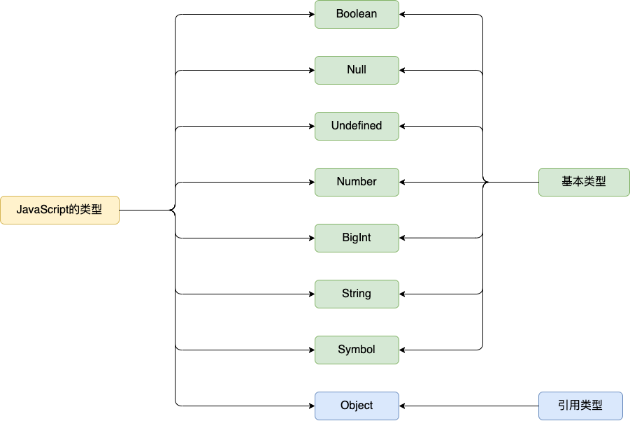

# JavaScript中如何判断一个变量是否是对象、数组

在工作中难免会遇到判断一个变量是否是对象、数组的问题，今天我来总结一下

## 1. 基础知识

### 1.1  JavaScript的变量类型



如上图所示，到目前为止JavaScript总共有8中类型，这8中类型分为基本类型和引用类型两大部分。

### 1.2 使用typeof运算符

typeof 操作符返回一个字符串，表示未经计算的操作数的类型。

typeof返回的所有结果入下图所示


### 1.3 JavaScript类型和typeof的对应关系

JavaScript类型和typeof的对应关系如下图所示，typeof的返回值和JavaScript类型并不是一一对应的关系。


## 2. 如何判断一个变量是否为对象

### 2.1 使用typeof进行判断

通过之前的讲解，我们知道typeof 返回'object'时该变量可能是Object也可能Null。因此我们可以先判断变量是否为null，如果不是再用typeof 进行判断。代码如下所示：

```javascript
isObject = obj => obj !== null && typeof obj === 'object'
```

### 2.2 使用Object.prototype.toString进行判断

我们之前已经讲解了如何使用typeof进行判断变量是否为对象，但是使用typeof有一个问题如下所示:

```javascript
console.log(typeof {a: 'a', b: 'b'}) // object
console.log(typeof Promise.resolve()) // object
console.log(typeof new Date()) // object
console.log(typeof [1, 2, 3]) // object
```

如果我们使用isObject函数对变量进行判断时不仅`{a: 'a', b: 'b'}`这样的对象能通过判断，而且像数组、Promise、Date这样的内置的构造函数所返回的对象也能通过判断。但是在有些情况下我们只是想判断一个变量是否是`{a: 'a', b: 'b'}`这样的纯对象，而不是由各种JavaScript内置构造函数生成的对象时使用typeof方法就会显得捉襟见肘。

对于判断一个变量是不是一个纯对象，我们可以使用Object.prototype.toString方法进行判断，代码如下所示：

```javascript
const isPlainObject = obj => Object.prototype.toString.call(obj) === '[object Object]'
```

之所以使用Object.prototype.toString，而不是obj.toString是因为有些对象的原型可能重写了toString方法，所以我们要显示的去调用Object.prototype.toString方法。

## 3. 如何判断一个对象是否为空对象

在我们的JavaScript项目中我们还经常需要判断一个变量是否为空对象，那么如何来实现对空对象的判断呢？

### 3.1 使用for in 循环来判断

```javascript
function isEmptyObj(obj) {
  for (let i in obj) {
    return false
  }
  return true
}
```

for in 循环会遍历当前对象和对象原型上的可枚举属性，因此我们可以使用for in来遍历一个对象。(由于{}.\__proto__上的属性全部为不可枚举所以for in 不会遍历到任何属性)。

缺点：但是这个方法并非完美，由于是只能遍历可枚举属性，所以如果一个对象上只有不可枚举属性的话，该方法会判断错误。

### 3.2 使用Object.keys方法判断

这种方法的核心是空对象自身是没有属性的，因此我们可以获取一个对象自身的属性，如果结果为空那么就是一个空对象。

```javascript
const isEmptyObj = obj => Object.keys(obj).length === 0
```

Object.keys能返回对象自身上所有可枚举属性的名称所构成的数组，因此如果数组长度为0，那么就是一个空对象。

缺点：如同使用for in循环进行判断一样，Object.keys方法也只返回可枚举属性，所以并不是很完美。

### 3.3 使用Object.getOwnPropertyNames方法判断

```javascript
const isEmptyObj = obj => Object.getOwnPropertyNames(obj).length === 0
```

该方法是Object.keys方法的改进，一样也是返回对象自身的属性名所构成的数组。但是与Object.keys方法不同的一点是该方法可以获取到不可枚举属性。

缺点：该方法无法获取到用Symbol表示的属性。（可以使用Object.getOwnPropertySymbols(obj)作为补充）代码如下：

```JavaScript
const isEmptyObj = obj => 
	Object.getOwnPropertyNames(obj).length === 0 && Object.getOwnPropertySymbols(obj).length === 0
```

### 3.4 使用Reflect.ownKeys方法判断

使用Reflect.ownKeys也可以返回对象自身属性名所构成的数组，该方法不仅返回正常的属性名，也返回不可枚举属性以及Symbol属性。

```javascript
const isEmptyObj = obj => Reflect.ownKeys(obj).length === 0
```

## 4. 如何判断一个变量是否是数组

判断一个变量是否数组有两种比较完美的方法，一种是使用Array.isArray方法，另一种是使用Object.prototype.toString方法。

### 4.1 使用Array.isArray方法

Array.isArray方法是ES6新增的专门判断一个对象是不是数组的方法。代码如下：

```javascript
const isArray = obj => Array.isArray(obj)
```

### 4.2 使用Object.prototype.toString方法

```javascript
const isArray = obj => Object.prototype.toString.call(obj) === '[object Array]'
```

### 4.3 完美解决方案

虽然判断是否为数组类型使用Array.isArray与Object.prototype.toString都可以但是Array.isArray是ES6的语法我们可以将这两个方法封装起来，形成一个完美的解决方案：

```javascript
function isArray(obj) {
  if (Array.isArray) {
    return Array.isArray(obj)
  } else {
    return Object.prototype.toString.call(obj) === '[object Array]'
  }
}
```